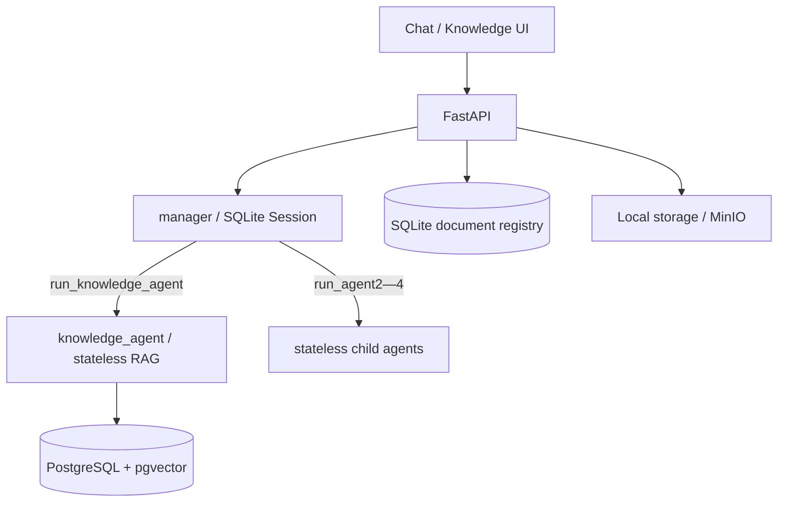

# Enterprise Agent

基于 FastAPI、OpenAI Agents SDK、DeepSeek、LlamaIndex 与 pgvector 的多 Agent
应用。Manager 持有短期会话记忆，`knowledge_agent` 负责检索知识库，agent2—agent4
保持无状态；Web UI 支持流式回答、Agent 执行轨迹和知识文档管理。



## 功能

- Manager 独占 `SQLiteSession`，同一 `{user_id}:{conversation_id}` 可复用多轮上下文。
- 子 Agent 通过 `Agent.as_tool()` 注册并保持无状态，不读取 Manager 历史。
- `knowledge_agent` 是唯一拥有 `search_knowledge_base` 工具的子 Agent。
- `POST /api/v1/chat/stream` 以 SSE 返回执行阶段、Agent 调用轨迹和最终回答。
- 知识库支持上传 TXT、Markdown、PDF 和 DOCX，后台解析并写入 pgvector。
- PDF 处理保留文本、表格和代码结构，可用千问视觉模型识别扫描页和正文图片。
- 文档管理支持任务状态、分块预览、下载、重新处理和删除。
- 原始文档可保存在本地持久化目录；配置 MinIO 后使用对象存储。
- FastAPI + Jinja2 提供聊天页和知识库管理页，不需要独立前端构建。

## 架构约束

只有 Manager 接收 Session。`knowledge_agent`、agent2、agent3 和 agent4 均保持无状态，
不能访问 Manager 会话历史。只有 `knowledge_agent` 可以注册内部知识库检索工具，其他子
Agent 保持 tool-free。

模型通过 `OpenAIChatCompletionsModel` 和 OpenAI-compatible client 接入 DeepSeek。
知识检索使用 LlamaIndex `VectorStoreIndex` 与 PostgreSQL `PGVectorStore`；千问
`text-embedding-v4` 默认生成 1024 维向量。更改嵌入模型或维度后必须完整重建索引。

## 目录

```text
app/
├── agents/{manager,knowledge_agent,agent2,agent3,agent4}/
├── api/routes/             # chat、knowledge、health 与页面路由
├── core/                   # 配置、日志与应用异常
├── knowledge/              # pgvector、上传、注册表与 PDF 处理
├── memory/                 # Manager SQLite Session
├── schemas/
├── services/               # 编排、SSE 和执行事件
├── static/
├── templates/
├── container.py
└── main.py
tests/{unit,integration}/
```

## 安装

需要 Python 3.11+：

```bash
python -m venv .venv
# Windows: .venv\Scripts\activate
# macOS/Linux: source .venv/bin/activate
python -m pip install -e ".[dev]"
```

在项目根目录创建 `.env`。不要提交真实密钥、数据库地址或模型请求。

## 配置

| 变量 | 说明 | 默认值 |
| --- | --- | --- |
| `DEEPSEEK_API_KEY` | DeepSeek API 密钥 | 无 |
| `DEEPSEEK_BASE_URL` | OpenAI-compatible 地址 | `https://api.deepseek.com` |
| `DEEPSEEK_MODEL` | 对话模型 | `deepseek-chat` |
| `SQLITE_SESSION_PATH` | Manager 会话数据库 | `data/sessions.db` |
| `SHORT_TERM_MEMORY_ENABLED` | 启用 Manager 自适应短期记忆 | `true` |
| `SHORT_TERM_CONTEXT_MAX_TOKENS` | 短期记忆估算 Token 上限 | `12000` |
| `SHORT_TERM_SUMMARY_TARGET_TOKENS` | 滚动摘要目标上限 | `1500` |
| `SHORT_TERM_RECENT_TURNS` | 优先保留的最近完整轮数 | `6` |
| `SHORT_TERM_MIN_RECENT_TURNS` | 超限时优先保证的完整轮数 | `2` |
| `SHORT_TERM_SUMMARY_BATCH_TURNS` | 触发滚动摘要的累计旧轮数 | `4` |
| `SHORT_TERM_SINGLE_MESSAGE_MAX_TOKENS` | 单条用户消息估算 Token 上限 | `4000` |
| `SHORT_TERM_FALLBACK_TURNS` | 摘要失败时最多保留的最近轮数 | `10` |
| `KNOWLEDGE_DATABASE_URL` | PostgreSQL/pgvector 连接地址 | 无 |
| `KNOWLEDGE_SCHEMA` | 知识库 schema | `agent_knowledge` |
| `KNOWLEDGE_TABLE` | 向量表 | `project_manual` |
| `DASHSCOPE_API_KEY` | 千问嵌入与视觉模型密钥 | 无 |
| `QWEN_EMBEDDING_BASE_URL` | 千问 OpenAI-compatible 地址 | 无 |
| `QWEN_EMBEDDING_MODEL` | 嵌入模型 | `text-embedding-v4` |
| `QWEN_EMBEDDING_DIMENSIONS` | 嵌入维度 | `1024` |
| `QWEN_VISION_BASE_URL` | 视觉模型地址；为空时复用嵌入地址 | 无 |
| `QWEN_VISION_MODEL` | PDF 视觉理解模型 | `qwen3-vl-plus` |
| `QWEN_VISION_MAX_PAGES` | 单文档最多识别扫描页数 | `100` |
| `QWEN_VISION_MAX_IMAGES` | 单文档最多理解图片数 | `50` |
| `KNOWLEDGE_TOP_K` | 默认检索节点数 | `5` |
| `KNOWLEDGE_UPLOAD_MAX_BYTES` | 单文件上传上限 | `10485760` |
| `KNOWLEDGE_REGISTRY_PATH` | 文档任务注册表 | `data/knowledge_documents.db` |
| `MINIO_ENDPOINT` | MinIO 地址；为空时使用本地存储 | 无 |
| `MINIO_ACCESS_KEY` | MinIO Access Key | 无 |
| `MINIO_SECRET_KEY` | MinIO Secret Key | 无 |
| `MINIO_BUCKET` | 文档存储桶 | `knowledge-documents` |
| `MINIO_SECURE` | 是否使用 HTTPS 连接 MinIO | `false` |

导入应用和离线测试不要求外部凭据；真实聊天、索引处理与视觉识别会访问对应外部服务。

## 知识库初始化

服务启动不会自动重建 pgvector 索引。首次部署时显式执行：

```bash
python -m app.knowledge.cli init
python -m app.knowledge.cli status
```

内置样例手册需要更新时执行：

```bash
python -m app.knowledge.cli rebuild
```

`init` 幂等创建 pgvector 扩展、schema、表和 HNSW 索引。`rebuild` 只重建配置的
知识集合，不影响 Manager Session 或上传文档注册表。

## 启动与使用

```bash
uvicorn app.main:app --reload --port 8091
```

- 聊天页面：`http://127.0.0.1:8091/`
- 知识库管理：`http://127.0.0.1:8091/knowledge`
- API 文档：`http://127.0.0.1:8091/docs`
- 健康检查：`GET /health`

普通聊天请求：

```bash
curl -X POST http://127.0.0.1:8091/api/v1/chat \
  -H "Content-Type: application/json" \
  -d '{"user_id":"user-001","conversation_id":"conversation-001","message":"查询项目知识"}'
```

流式聊天请求：

```bash
curl -N -X POST http://127.0.0.1:8091/api/v1/chat/stream \
  -H "Content-Type: application/json" \
  -d '{"user_id":"user-001","conversation_id":"conversation-001","message":"查询项目知识"}'
```

上传文档：

```bash
curl -X POST http://127.0.0.1:8091/api/v1/knowledge/documents \
  -F "file=@manual.pdf"
```

文档相关 API：

- `GET /api/v1/knowledge/documents`
- `GET /api/v1/knowledge/documents/{task_id}`
- `GET /api/v1/knowledge/documents/{task_id}/chunks`
- `GET /api/v1/knowledge/documents/{task_id}/download`
- `POST /api/v1/knowledge/documents/{task_id}/reprocess`
- `DELETE /api/v1/knowledge/documents/{task_id}`

## Docker

```bash
docker build -t l-agents:latest .
docker run -d \
  --name l-agents \
  --restart unless-stopped \
  --env-file .env \
  -p 8000:8000 \
  -v "$(pwd)/data:/app/data" \
  l-agents:latest
```

服务器网络受限时可指定 PyPI 镜像：

```bash
docker build \
  --build-arg PIP_INDEX_URL=https://pypi.tuna.tsinghua.edu.cn/simple \
  -t l-agents:latest .
```

## 验证

```bash
python -m compileall app
pytest
ruff check .
```

测试使用 Fake Runner、Fake Service 和临时数据库，不调用真实模型或外部网络。

## 当前边界

项目尚未提供身份认证、授权、限流、Redis/分布式 Session、持久化任务队列、MCP、
代码执行或人工审批。后台文档处理目前依赖进程内任务；多副本生产部署应迁移到独立任务队列，
并为对象存储、数据库迁移、可观测性和失败恢复补充运维方案。
