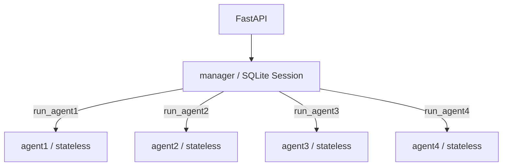

# Enterprise Agent

一个基于 FastAPI 与 OpenAI Agents SDK 的最小多 Agent 骨架。当前版本只验证：有短期会话记忆的 Manager、四个无状态子 Agent、Agent-as-Tool 调用以及可测试的 HTTP 边界。



## 设计

`manager` 负责理解用户明确指定的 Agent、调用对应工具并形成最终回答。agent1—agent4 目前没有工具、Session 或业务逻辑，无论输入为何都被提示只返回各自固定文本。它们无状态是为了避免子 Agent 历史污染和重复记忆；Session 只传给 Manager，使同一 `{user_id}:{conversation_id}` 的多轮对话由一个明确边界维护。

实现针对安装并验证过的 `openai-agents 0.22.0`：子 Agent 通过 `Agent.as_tool()` 注册，Manager 通过 `Runner.run(..., session=session)` 使用 `SQLiteSession`。Agent-as-Tool 没有配置 Session，因此子 Agent 不接触 Manager 历史。模型通过 `OpenAIChatCompletionsModel` 和 OpenAI-compatible client 接入 DeepSeek。

## 目录

```text
app/
├── agents/{manager,agent1,agent2,agent3,agent4}/
├── api/routes/
├── core/
├── memory/
├── schemas/
├── services/
├── container.py
└── main.py
tests/{unit,integration}/
```

## 安装与配置

需要 Python 3.11+：

```bash
python -m venv .venv
# Windows: .venv\Scripts\activate
# macOS/Linux: source .venv/bin/activate
python -m pip install -e ".[dev]"
cp .env.example .env
```

在 `.env` 中设置 `DEEPSEEK_API_KEY`，不要提交真实密钥。模型配置为 `DEEPSEEK_BASE_URL` 和 `DEEPSEEK_MODEL`；其余配置包括 `APP_NAME`、`APP_ENV`、`LOG_LEVEL` 和 `SQLITE_SESSION_PATH`。导入应用和运行测试都不要求 API Key；只有真实聊天请求会调用 DeepSeek。

## 启动与调用

```bash
uvicorn app.main:app --reload
```

聊天页面由 FastAPI + Jinja2 服务端渲染，模板位于 `app/templates/chat.html`，原生 JavaScript 与样式位于 `app/static/`。不需要 Node.js 或单独启动前端服务；启动 FastAPI 后直接访问根地址即可。

```bash
curl -X POST http://127.0.0.1:8000/api/v1/chat \
  -H "Content-Type: application/json" \
  -d '{"user_id":"user-001","conversation_id":"conversation-001","message":"请调用agent1"}'
```

继续使用相同的 `user_id` 与 `conversation_id` 即复用同一 SQLite Session。健康检查为 `GET /health`。

## 验证

```bash
python -m compileall app
pytest
ruff check .
```

测试用 Fake Runner / Fake ChatService，不调用真实模型，也不访问外部网络。

## 当前边界与演进

当前没有认证、SSE、WebSocket、限流、长期记忆、Redis、RAG、数据库业务查询、数据分析、代码执行、MCP、Skills、后台任务或审批。

要为某个子 Agent 增加真实逻辑，只修改其独立目录中的 prompt 和 agent 工厂，并在确有需要时新增工具及测试；不要把 Manager Session 下放给它。生产环境需要共享会话时，可保持 `SessionFactory.create(user_id, conversation_id)` 接口不变，将内部 `SQLiteSession` 替换为 SDK 支持的 Redis Session，并补充连接配置、生命周期和集成测试。
