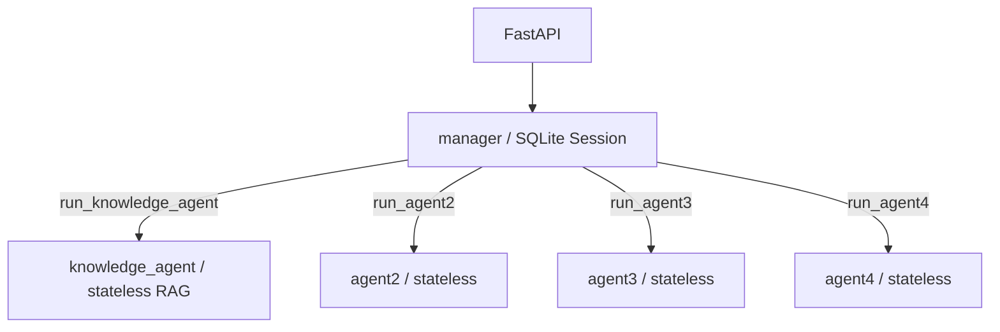

# Enterprise Agent

一个基于 FastAPI、OpenAI Agents SDK、DeepSeek 与 LlamaIndex 的多 Agent 骨架。Manager 拥有短期会话记忆，`knowledge_agent` 通过 pgvector 检索项目知识，agent2—agent4 保持固定回复。



## 设计

`manager` 负责理解用户请求、调用对应工具并形成最终回答。`knowledge_agent` 是无状态项目知识检索 Agent，拥有唯一的 `search_knowledge_base` Tool；agent2—agent4 仍只返回固定文本。子 Agent 不接触 Session，避免历史污染和重复记忆；Session 只传给 Manager，使同一 `{user_id}:{conversation_id}` 的多轮对话由一个明确边界维护。

实现针对安装并验证过的 `openai-agents 0.22.0`：子 Agent 通过 `Agent.as_tool()` 注册，Manager 通过 `Runner.run(..., session=session)` 使用 `SQLiteSession`。Agent-as-Tool 没有配置 Session，因此子 Agent 不接触 Manager 历史。模型通过 `OpenAIChatCompletionsModel` 和 OpenAI-compatible client 接入 DeepSeek。

知识库使用 LlamaIndex `VectorStoreIndex` 与 PostgreSQL `PGVectorStore`。千问 `text-embedding-v4` 生成 1024 维向量；LlamaIndex 只返回检索节点，不负责生成答案。`knowledge_agent` 根据证据回答并保留 `[项目使用手册 > 章节]` 引用。没有公开知识库检索 API。

## 目录

```text
app/
├── agents/{manager,knowledge_agent,agent2,agent3,agent4}/
├── api/routes/
├── core/
├── memory/
├── schemas/
├── services/
├── container.py
└── main.py
tests/{unit,integration}/
```

## 安装与配置

需要 Python 3.11+：

```bash
python -m venv .venv
# Windows: .venv\Scripts\activate
# macOS/Linux: source .venv/bin/activate
python -m pip install -e ".[dev]"
cp .env.example .env
```

复制 `.env.example` 为 `.env`，设置 DeepSeek、千问和 PostgreSQL 配置，不要提交真实密钥。导入应用和运行测试都不要求外部凭据；只有真实聊天请求或知识库 CLI 会访问外部服务。

知识库关键配置包括 `KNOWLEDGE_DATABASE_URL`、`DASHSCOPE_API_KEY`、`QWEN_EMBEDDING_BASE_URL`、`QWEN_EMBEDDING_MODEL`、`QWEN_EMBEDDING_DIMENSIONS` 和 `KNOWLEDGE_TOP_K`。当前索引固定为 1024 维；更改模型或维度后必须完整重建。

## 知识库管理

服务启动不会修改知识库。首次部署和更新样例手册时显式运行：

```bash
python -m app.knowledge.cli init
python -m app.knowledge.cli rebuild
python -m app.knowledge.cli status
```

`init` 幂等创建 pgvector 扩展、schema、表和 HNSW 索引。`rebuild` 仅清空并重建 `KNOWLEDGE_SCHEMA.KNOWLEDGE_TABLE` 对应的知识集合，不影响 SQLite Session。数据库账号需要创建扩展、schema 和表的权限。

## 启动与调用

```bash
uvicorn app.main:app --reload
```

聊天页面由 FastAPI + Jinja2 服务端渲染，模板位于 `app/templates/chat.html`，原生 JavaScript 与样式位于 `app/static/`。不需要 Node.js 或单独启动前端服务；启动 FastAPI 后直接访问根地址即可。

```bash
curl -X POST http://127.0.0.1:8000/api/v1/chat \
  -H "Content-Type: application/json" \
  -d '{"user_id":"user-001","conversation_id":"conversation-001","message":"请调用知识检索 Agent"}'
```

继续使用相同的 `user_id` 与 `conversation_id` 即复用同一 SQLite Session。健康检查为 `GET /health`。

## 验证

```bash
python -m compileall app
pytest
ruff check .
```

测试用 Fake Runner / Fake ChatService，不调用真实模型，也不访问外部网络。

## 当前边界与演进

当前没有认证、SSE、WebSocket、限流、长期记忆、Redis、用户文档上传、公开检索 API、数据库业务查询、数据分析、代码执行、MCP、Skills、后台任务或审批。

要为某个子 Agent 增加真实逻辑，只修改其独立目录中的 prompt 和 agent 工厂，并在确有需要时新增工具及测试；不要把 Manager Session 下放给它。生产环境需要共享会话时，可保持 `SessionFactory.create(user_id, conversation_id)` 接口不变，将内部 `SQLiteSession` 替换为 SDK 支持的 Redis Session，并补充连接配置、生命周期和集成测试。
